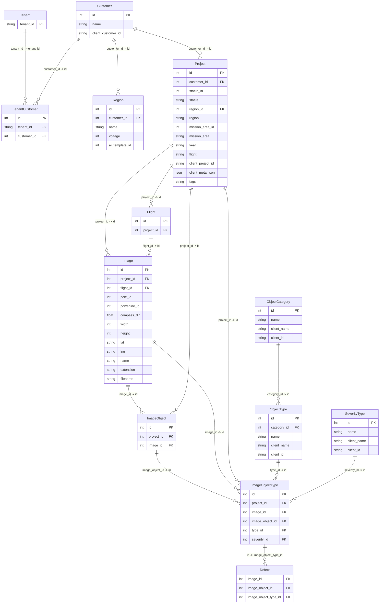

# Data Model Diagram

```mermaid
erDiagram
		Tenant {
			string tenant_id PK
		}

		TenantCustomer {
			int id PK
			string tenant_id FK
			int customer_id FK
		}

		Customer {
			int id PK
			string name
			string client_customer_id
		}

		Region {
			int id PK
			int customer_id FK
			string name
			int voltage
			int ai_template_id
		}

		Project {
			int id PK
			int customer_id FK
			int status_id
			string status
			int region_id FK
			string region
			int mission_area_id
			string mission_area
			string year
			string flight
			string client_project_id
			json client_meta_json
			string tags
		}

		Flight {
			int id PK
			int project_id FK
		}

		Image {
			int id PK
			int project_id FK
			int flight_id FK
			int pole_id
			int powerline_id
			float compass_dir
			int width
			int height
			string lat
			string lng
			string name
			string extension
			string filename
		}

		ImageObject {
			int id PK
			int project_id FK
			int image_id FK
		}

		ImageObjectType {
			int id PK
			int project_id FK
			int image_id FK
			int image_object_id FK
			int type_id FK
			int severity_id FK
		}

		Defect {
			int image_id FK
			int image_object_id FK
			int image_object_type_id FK
		}

		ObjectType {
			int id PK
			int category_id FK
			string name
			string client_name
			string client_id
		}

		ObjectCategory {
			int id PK
			string name
			string client_name
			string client_id
		}

		SeverityType {
			int id PK
			string name
			string client_name
			string client_id
		}

		Tenant ||--o{ TenantCustomer : "tenant_id -> tenant_id"
		Customer ||--o{ TenantCustomer : "customer_id -> id"
		Customer ||--o{ Region : "customer_id -> id"
		Customer ||--o{ Project : "customer_id -> id"

		Project ||--o{ Flight : "project_id -> id"
		Project ||--o{ Image : "project_id -> id"
		Flight ||--o{ Image : "flight_id -> id"

		Image ||--o{ ImageObject : "image_id -> id"
		Project ||--o{ ImageObject : "project_id -> id"

		ImageObject ||--o{ ImageObjectType : "image_object_id -> id"
		Image ||--o{ ImageObjectType : "image_id -> id"
		Project ||--o{ ImageObjectType : "project_id -> id"

		ObjectCategory ||--o{ ObjectType : "category_id -> id"
		ObjectType ||--o{ ImageObjectType : "type_id -> id"
		SeverityType ||--o{ ImageObjectType : "severity_id -> id"

		ImageObjectType ||--o{ Defect : "id -> image_object_type_id"
```
