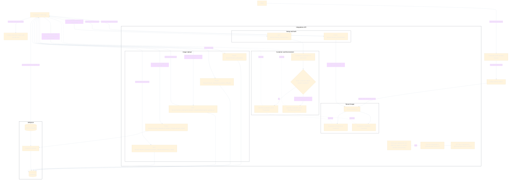

# Image Upload Flow Overview

```mermaid
%%{init: {'theme': 'base', 'themeVariables': {'background': '#0b1020', 'lineColor': '#cbd5e1', 'textColor': '#e5e7eb', 'primaryTextColor': '#e5e7eb', 'clusterBkg': 'transparent', 'clusterBorder': '#6b7280'}}}%%
flowchart TB
	Client[Client]
	TenantAdmin[Arkion Tenant Admin]
	KeyPair[Generate public/private keypair]

	subgraph CLIENT_AUTH_ROW[ ]
		direction LR
		ClientApp[Customer Client App]
		AssertionToken[Create assertion token with private key]
		ClientApp -->|0.3 Build assertion token| AssertionToken
	end

	Client ~~~ ClientApp

	subgraph INTEGRATIONS[Integrations API]
		direction TB

		subgraph INTEGRATIONS_TOP[ ]
			direction LR
			Domain[Domain integrations-gateway.app.arkion.co]
			ApiDocs[API docs integrations-gateway.app.arkion.co/docs]
			DomainNote[Note app subdomain can differ by region or custom domain environment]
			Domain --- ApiDocs
			DomainNote -. note .- Domain
			DomainSpacer[ ]
		end

		subgraph INTEGRATIONS_BODY[ ]
			direction LR

			subgraph TENANT[Tenant Scope]
				direction TB
				Tenant[Tenant tenant_id]
				CustProd[Customer A Production Customer]
				CustSandbox[Customer A Sandbox Customer]
				Tenant --> CustProd
				Tenant --> CustSandbox
			end

			subgraph CUSTOMERENV[Customer and Environment]
				direction TB
				CustList[Customers response: id and name]
				NameCheck{Does customer name contain sandbox?}
				UseProd[Use this customer_id for Production]
				UseSandbox[Use this customer_id for Dev/QA environment]
				CustList --> NameCheck
				NameCheck -->|No| UseProd
				NameCheck -->|Yes contains sandbox => Dev/QA| UseSandbox
			end

			subgraph SETUPAUTH[Setup and Auth]
				direction TB
				Auth[POST /tenant/:tenant_id/auth/token]
				GetCustomers[GET /tenant/:tenant_id/customers]
			end

			subgraph IMAGEUPLOAD[Image Upload]
				direction TB
				CreateProject[POST /tenant/:tenant_id/projects]
				CreateFlight[POST /tenant/:tenant_id/projects/:project_id/flights]
				GetSignedUrl[GET /tenant/:tenant_id/projects/:project_id/upload/presigned_upload_url]
				StartImport[POST /tenant/:tenant_id/projects/:project_id/upload/start_import]
				InferenceStatus[GET /tenant/:tenant_id/projects/:project_id/upload/inference_status]
			end
		end

		GetCustomers ~~~ CreateProject ~~~ CreateFlight ~~~ GetSignedUrl ~~~ StartImport ~~~ InferenceStatus
		UseProd -. maps to .- CustProd
		UseSandbox -. maps to .- CustSandbox
		UseProd -. used by .- ClientApp
		UseSandbox -. used by .- ClientApp

	end

	subgraph AWS[Inference]
		direction TB
		S3[(AWS S3 Bucket)]
		Worker[Inference Worker]
		Db[(Database)]
	end

	Client -->|0.1 Generate keypair| KeyPair
	KeyPair -->|0.2 Save public key| TenantAdmin
	TenantAdmin -->|Public key saved for tenant| Tenant
	ClientApp -->|0.4 POST assertion token| Auth
    
	Auth -->|Returns access token| ClientApp
	Auth -->|Token scoped by tenant/customer| Tenant

	ClientApp -->|0.5 Lookup available customers| GetCustomers
	GetCustomers --> CustList

	ClientApp -->|1 Create project with chosen customer_id &#40;optional&#41;| CreateProject
	CreateProject --> Db

	ClientApp -->|2 Create flight| CreateFlight
	CreateFlight --> Db

	ClientApp -->|3 Request signed_url per image| GetSignedUrl
	GetSignedUrl -->|Returns signed_url| ClientApp
	GetSignedUrl --> Db

	ClientApp -->|4 PUT image via signed_url| S3

	ClientApp -->|5 Start import after all uploads| StartImport
	StartImport --> Worker
	Worker --> Db
	S3 --> Worker

	ClientApp -->|6 Poll inference status| InferenceStatus
	InferenceStatus --> Db

	style INTEGRATIONS fill:transparent,stroke:#6b7280,stroke-width:1.2px
	style INTEGRATIONS_TOP fill:transparent,stroke:transparent,color:transparent
	style INTEGRATIONS_BODY fill:transparent,stroke:transparent,color:transparent
	style CLIENT_AUTH_ROW fill:transparent,stroke:transparent,color:transparent
	style TENANT fill:transparent,stroke:#6b7280,stroke-width:1px
	style CUSTOMERENV fill:transparent,stroke:#6b7280,stroke-width:1px
	style SETUPAUTH fill:transparent,stroke:#6b7280,stroke-width:1px
	style IMAGEUPLOAD fill:transparent,stroke:#6b7280,stroke-width:1px
	style AWS fill:transparent,stroke:#6b7280,stroke-width:1.2px
	style DomainSpacer fill:transparent,stroke:transparent,color:transparent

```
